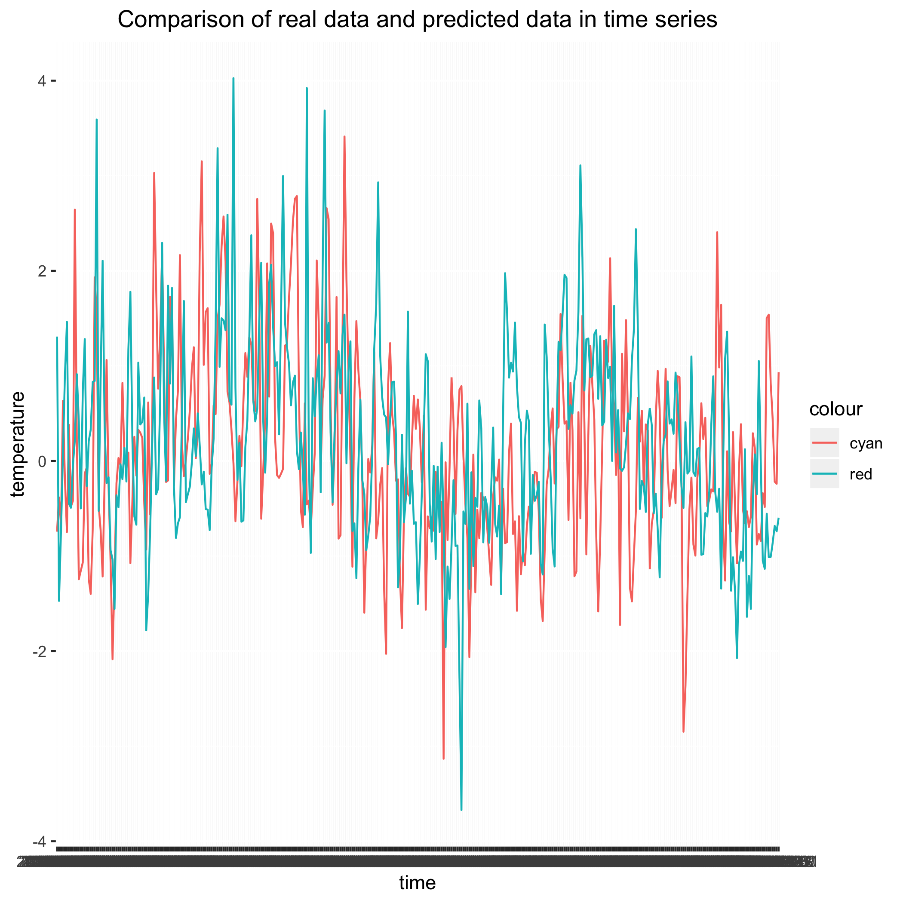

## Introduction

In this project, we plan to analyse the environmental situations in different geographical areas, including their temperature, wind and degree of moisture. We want to know whether these features have an explainable regularity that can be use to predict, so as to have a better understanding of the earth we live in. Here we use merra data, which includes several climate features observed by metrorological staitions in recent 10 years. We form reasonable time series models to predict the related features. We find that our predict result have a same trend as the real data.

{width=400px}

## Conclusion

As shown in `Figure 1`, the time series model approximately fits the test data of 2-meter eastward wind speed, indicating that our model has the ability to predict future environmental situations in the western part of United States. 

According to the latest log file `tsjob-chtc_187671.log`, it costs, on averqage, 40 seconds, to train one time series model. Given that there are 357 locations, each has 14 model to train which adds up to 4998 models and about 55 hours, without the help of parallel computing, it will be extremely time-consuming to run this job on a normal laptop. 